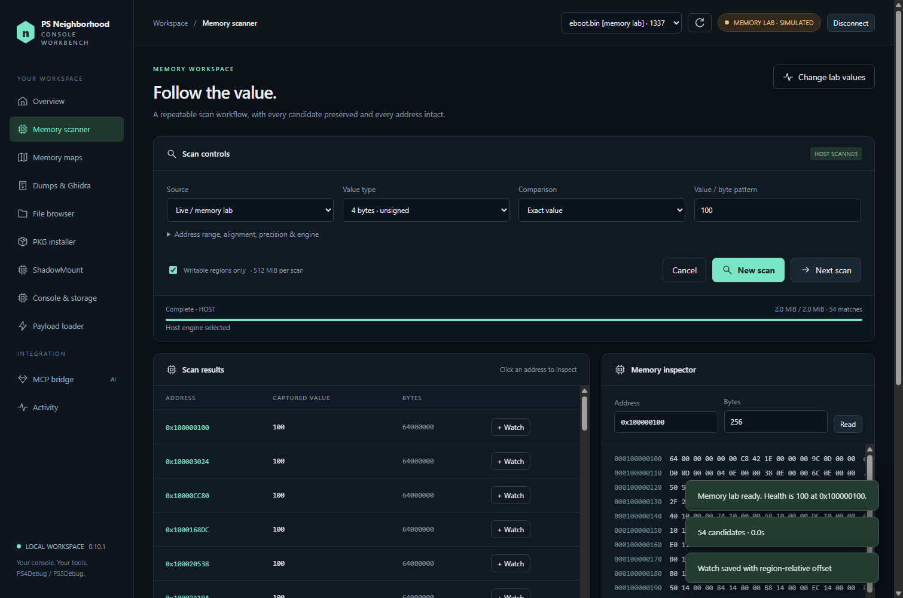

# PS Neighbourhood

[](https://github.com/GronedWaffel/ps-neighbourhood/releases/latest) [](LICENSE)   

**Your PS4 / PS5 memory workbench: scanning, MCP tools, Ghidra RAM exports, FTP and payload loading, plus platform-specific package and console management.**

PS Neighbourhood brings console tools into one Windows desktop app. Explore a running game's memory through PS4Debug or PS5Debug-NG, capture regions for offline analysis, build a trainer, or install a folder of local PKGs directly from your PC. An integrated [Model Context Protocol](https://modelcontextprotocol.io/) server gives compatible AI clients access to the same memory workflow.

> **PS4 compatibility: only PS4 firmware 10.01 has been hardware-tested.** Other listed PS4 firmware targets are experimental, including versions below 10.01. Individual features have their own validation limits below.
>
> **PS5 13.60 support is here:** memory scanning, guarded writes, MCP, Ghidra RAM exports, FTP, ELF loading, PS4/PS5 PKG installation and folder queues, game launch/close, storage inventory, uninstall, power controls, and PS5 save export/restore. These workflows have scoped hardware checks on 13.60. The BO2 trainer remains PS4-only; external/M.2 drive behavior has automated coverage but no attached-drive hardware test. See the [PS5 setup guide](docs/PS5.md), [save guide](docs/PS5-SAVES.md), and [validation record](docs/PS5-VALIDATION.md).

[Getting started](#getting-started) · [Features and options](#features-and-options) · [MCP setup](docs/MCP.md) · [Compatibility](docs/COMPATIBILITY.md) · [Build from source](#build-from-source) · [Roadmap](docs/ROADMAP.md)

**Contributors and testers welcome!** Fork the project, open a pull request, or help verify another firmware or software version. Improvements to the scanner, MCP tools, trainers, receiver, UI and documentation are all welcome. [Start contributing](CONTRIBUTING.md) or [submit a compatibility report](https://github.com/GronedWaffel/ps-neighbourhood/issues/new?template=firmware_report.md).



## Getting started

### Windows portable release

1. Download the Windows x64 ZIP from the [Releases page](https://github.com/GronedWaffel/ps-neighbourhood/releases/latest) and extract the whole folder somewhere writable.
2. Run **PS Neighbourhood.exe** for the standard workspace, or **Start PS5 Neighbourhood.cmd** for a separate PS5 workspace. No separate Node.js installation is needed.
3. Enter your console's local IP in the console profile. The initial localhost value is a placeholder.
4. Select PS4 or PS5 and enable the services needed for your task. Debugger **744**, FTP **2121**, PS4 BinLoader **9090**, and PS5 ELF Loader **9021** are typical ports; all are editable. FTP and ELF loading work independently of a memory connection.
5. For PKGs and native console controls, load the platform-specific **PS Neighbourhood background receiver**: BinLoader on PS4, ELF Loader on PS5. Follow the [PS5 setup guide](docs/PS5.md) for its companion connection.

PS4Debug or a compatible PS5Debug-NG service must already be running for live memory tools. PS5Debug-NG 1.3.2 supports verified native integer scans; other scan types use the host scanner. Reuse an existing PS4Debug session; **do not load another copy just because a connection fails**. The app does not jailbreak your console and does not include GoldHEN or PS4Debug.

No console available? Choose **Open memory lab** to try scanning, inspection, watches and dumps against simulated memory. Simulated memory operations do not contact a console.

Keep the portable folder together. Your settings, MCP bridge credentials, downloads, scans and captures live under `resources/app/data`; source builds use `data`. The separate PS5 launcher uses `resources/app/data/ps5` (or `data/ps5` from source). Keep that directory private. Set `PSN_DATA` to use another directory, and use the same value for the main app, trainer and MCP client.

## Features and options

Memory tools, MCP, dumps, FTP, payload transfer, inventory, capacity and encrypted save archives have PS4/PS5 paths. PS5 uses its own native companion for game/power controls and an experimental AppInstUtil installer. See the PS5 validation record for measured results and test scope. The PS4 receiver is never loaded on PS5.

### Memory scanner and inspector

- Scan integer and floating-point values, text, and array-of-bytes patterns with wildcards.
- Start from an exact value or an unknown initial value, then refine by changed, unchanged, increased, decreased or a value range.
- Inspect hex and ASCII, decode typed structures, extract strings, follow 64-bit pointers and watch addresses.
- **Host scanner:** disk-backed candidates and paged results; works with the classic PS4Debug protocol.
- **PS4Debug-NG scanner:** negotiated native integer scans when the payload advertises support. Unsupported types fall back to the host engine. NG has automated protocol coverage but still needs real-console validation.
- Explicit scan selections are bounded to 512 MiB. Cancel jobs, inspect progress and continue refining without presenting every candidate at once.
- Memory writes compare the expected bytes first and verify by reading back. This is not atomic against a running game. MCP writes require an explicit switch in the desktop.

### RAM capture, Ghidra and offline research

Select readable mappings or a bounded address range and save raw memory segments with original addresses, permissions, SHA-256 hashes and a manifest. A generated Java importer helps place the segments into Ghidra at their captured addresses; [Ghidra](https://github.com/NationalSecurityAgency/ghidra) is installed separately. Ghidra 12.1.3 import, saving/reopening and analysis passed byte/address/permission verification on a real PS5 capture and a multi-region fixture. See the [Ghidra guide](docs/GHIDRA.md).

Scan dumps offline, compare captures, inspect strings and structures, or reverse-search for pointer chains up to five levels deep. Searches expose truncation and require revalidation across captures. Captures are sequential, not an atomic snapshot; ASLR addresses can change between sessions. These exports do not reconstruct an original executable.

### Install PKGs directly from your PC

Choose a local PKG or **add a whole folder**, optionally including subfolders. Review detected files, remove unwanted entries and run the queue. Duplicate entries are ignored, invalid headers are flagged, and packages are submitted sequentially. The queue stops on errors or uncertain replies and is not persisted between app sessions.

- **Background receiver:** our included, source-built PS4 receiver or PS5 companion runs in the console background. You do not have to leave a Remote Package Installer app open on the console.
- **Remote Package Installer:** an optional compatibility route for an existing RPI installation; its console app must be open. Configure its API port for your fork.
- Files stream directly from their existing PC location. There is no USB transfer or second full local copy.
- Progress distinguishes transferred data from final installation. Check the console's download/install status if the connection is interrupted.
- Keep the PC and app running until installation finishes; minimizing is fine. The app prevents idle sleep during file serving, but cannot prevent a manual shutdown.

The background receiver normally uses TCP **9697** for its authenticated callback and **9696** for PKG serving. Allow the console to reach those ports on your private network. PKG checks validate headers, declared size and content identity, not cryptographic integrity or firmware/backport compatibility. Bring your own package files; none are provided.

### Storage, games and saves

View installed games, separate patches and DLC, available drive capacity, category sizes and save groups. Some bundled content can be recognized from mounted game assets, including BO1/BO2 profiles. Bundled assets are not separately removable DLC, and finding an asset does not prove that all DLC is present or playable. File totals are logical sizes and can differ from disk allocation.

Launch or close games, uninstall a game or its separate patch, and request shutdown, restart or rest mode from desktop controls. Destructive actions identify their target; running-title removal is refused. On PS5 13.60, test-content uninstall, patch removal, rest mode and restart passed hardware checks. Shutdown was tested successfully by the user. External-storage scenarios also need hardware testing.

Download an encrypted save group, key files and metadata with a SHA-256 manifest while the game is closed. On **PS5 13.60**, also export decrypted PS5 files, prepare edits to existing files, and confirm a restore to the same console/user. Original encrypted backups are retained; staged copies are re-encrypted and verified before replacement. Account resigning and cross-console transfer are not implemented. See the [PS5 save guide and hardware test limits](docs/PS5-SAVES.md).

### FTP and payload loader

Browse the console's filesystem, download files and upload files through passive anonymous FTP. Downloads are staged before the final rename; uploads refuse to overwrite an existing file. Transfer resume and recursive FTP queues are not implemented.

Send a selected local payload with a displayed SHA-256 hash: PS4 uses BinLoader; PS5 uses a 64-bit x86-64 ELF Loader. PS5 headers and load-segment bounds are validated before connecting, and PS4 binaries are rejected. Service checks do not probe the loader with an empty connection. A completed transfer means the bytes were sent; it does not confirm that the payload executed successfully.

### BO2 Zombies trainer

Open **BO2 Zombies Trainer.cmd** while the main app is connected and **MCP bridge → Allow MCP compare-and-write** is enabled. The trainer uses the same MCP tools as other clients.

Controls include points, clip refill/freeze, god mode, movement speed, FOV, native perk-effect toggles, replacement of the held weapon and supported Pack-a-Punch weapon variants. Clip refill stops on weapon changes and must be enabled again. Weapon replacement preserves the holstered slot rather than adding another primary.

This profile targets one verified `codzm.elf` build with title ID `CUSA57548`; it checks content identity and an executable fingerprint before writing. It is not a universal BO2 trainer. Perk purchase scripts/HUD icons are not implemented, and armory, perk behavior and sustained clip refill have additional validation limits. See the [trainer guide](trainers/bo2-zombies/README.md) for exact controls and evidence.

### Built-in MCP server

Connect Cursor or another stdio MCP client to the server. Use **MCP bridge → Copy configuration** in the running app so paths match your installation. The Node entry point is `src/mcp.mjs`; there is no Python `psn.mcp_server` module.

Tools cover processes, mappings, bounded reads, structures, strings, scans, watches, guarded writes, RAM dumps, offline inspection, pointer searches, FTP, package inspection/status, console inventory and save backup. Payload loading, installation submission, uninstall and power actions stay in the desktop. See [MCP setup and tool reference](docs/MCP.md).

## Firmware and validation

**10.01 is the only hardware-tested PS4 firmware.** The receiver has explicit experimental targets for **9.00, 9.03, 9.04, 9.50, 9.51, 9.60, 10.00, 10.50, 10.70, 10.71, 11.00 and 13.52**. A listed target or editable firmware profile does not prove compatibility. Unknown receiver firmware is rejected before credential initialization. Every console still needs compatible jailbreak, debugging and BinLoader capabilities.

On 10.01, live checks covered classic PS4Debug memory workflows, selected trainer controls, a completed PC-to-PS4 package installation, console inventory, save backup and game launching. Automated tests exercise additional paths using simulation and native dispatch fixtures; they do not substitute for console testing. Read the [compatibility notes](docs/COMPATIBILITY.md) before trying an experimental target.

**PS5 13.60:** v0.9.0 includes PS5Debug-NG integration and a separate native companion for package installation, game and power controls, storage, and PS5 save operations. Hardware checks cover the features summarized above; [the option audit](docs/PS5-VALIDATION.md) records the scope. Other PS5 firmware is not confirmed. PS4 firmware numbers and payloads do not imply PS5 compatibility.

## Build from source

Requires **Windows x64**, **Node.js 24 or newer**, npm, and **Zig 0.14.1** for the native receiver and its regression test. Download Zig from [ziglang.org](https://ziglang.org/download/) and verify its published checksum. The compiler is not committed or included in the portable release.

For PS5 builds and portable packaging, also obtain the [PS5 payload SDK v0.43](https://github.com/ps5-payload-dev/sdk/releases/tag/v0.43). See [PS5 companion build instructions](receiver-ps5/README.md).

From a checkout, in PowerShell:

```powershell
npm ci
$env:ZIG = 'C:\path\to\zig.exe'
npm run build:receiver
$env:PS5_PAYLOAD_SDK = 'C:\path\to\ps5-payload-sdk'
node receiver-ps5/build.mjs
npm test
npm start
```

If Electron's install script was disabled by your npm configuration, run `node node_modules/electron/install.js` before starting. Alternatively, place Zig at `tools/zig-x86_64-windows-0.14.1/zig.exe`, which is the build's fallback location.

```powershell
# Simulated desktop smoke test; does not contact the PS4
node node_modules/electron/cli.js tests/ui-smoke.cjs

# Build the portable Windows folder, including the native receiver and trainer
npm run package
```

Output: `dist/PS-Neighbourhood-0.9.0-win-x64/`. Packaging refuses to overwrite an existing version's folder. Keep that folder outside Git. Source launchers start the source checkout; portable launchers start their accompanying executable.

## Contributing

**Pull requests are encouraged.** This project is open to other developers, testers and documentation contributors. Small fixes, new features, reproducible bug reports and compatibility work all help. Fork the repository, make a focused change and open a PR against `main`; draft PRs are welcome for work in progress. For a larger change, open an issue first to discuss the approach.

**Help confirm other versions.** If you have another PS4 firmware, PS4Debug/NG or GoldHEN version, Windows setup, MCP client or Ghidra release, please report what works and what fails. Include exact versions, app release/commit, console model where relevant, steps and repeatable results. You can contribute a test report without writing code. Start with read-only checks and leave unsupported firmware guards in place.

Project hardware checks cover PS4 10.01 and limited PS5 13.60 workflows. Reviewed community results will be recorded by feature and exact environment in the [compatibility notes](docs/COMPATIBILITY.md), with links to the evidence. One successful connection will not be presented as confirmation that every feature works.

See the [contribution guide](CONTRIBUTING.md), [open issues](https://github.com/GronedWaffel/ps-neighbourhood/issues), or [submit a compatibility report](https://github.com/GronedWaffel/ps-neighbourhood/issues/new?template=firmware_report.md).

Please do not attach credentials, account details, save files, game packages, Sony binaries or raw memory dumps to public issues. Share a minimal synthetic reproduction or redacted log instead.

## Credits and license

PS Neighbourhood is released under **GPL-3.0-or-later**; see [LICENSE](LICENSE) and [THIRD-PARTY-NOTICES.md](THIRD-PARTY-NOTICES.md). Third-party components retain their own licenses. Complete receiver source and build instructions are included for [PS4](receiver/README.md) and [PS5](receiver-ps5/README.md).

Built on the work of [GoldHEN](https://github.com/GoldHEN/GoldHEN), [PS4Debug](https://github.com/GoldHEN/ps4debug), [jogolden/ps4debug](https://github.com/jogolden/ps4debug), [PS4Debug-NG](https://github.com/OpenSourcereR-dev/ps4debug-NG), [DirectPackageInstaller](https://github.com/marcussacana/DirectPackageInstaller), [Remote Package Installer](https://github.com/flatz/ps4_remote_pkg_installer), [OpenOrbis](https://github.com/OpenOrbis/OpenOrbis-PS4-Toolchain), [ps4-payload-dev/sdk](https://github.com/ps4-payload-dev/sdk), [Electron](https://github.com/electron/electron) and the [MCP TypeScript SDK](https://github.com/modelcontextprotocol/typescript-sdk). Additional attribution is in the third-party notices.

Independent homebrew project. Not affiliated with or endorsed by Sony Interactive Entertainment.
